## My projects

公开项目

|项目名|介绍|语言|状态|
|:---:|:---:|:---:|:---:|
|[Link2telegram](https://github.com/Crystal-Moling/link2telegram)|使用Telegram管理我的世界服务器的插件|Java|**更新中**|
|[L2t-MCSManager](https://github.com/Crystal-Moling/L2t-MCSManager)|使用Link2telegram调用MCSManagerAPI|Java|**更新中**|
|[CrystalADBToolkit](https://github.com/Crystal-Moling/CrystalADBToolkit-Public)|图形化ADB工具箱|C#|**开发中**|
|[ARKCore-Project](https://github.com/Crystal-Moling/ARKCore-Project)|我的世界启动库|C#|**暂缓**|
|[BuyTempFly](https://github.com/Crystal-Moling/BuyTempFly)|用于购买TempFly插件飞行时间的插件|Java|**已完结**|
|[White-Obsidian-Craft-Launcher](https://github.com/Crystal-Moling/White-Obsidian-Minecraft-Launcher)|基于KMCCC的我的世界启动器|C#|**已弃坑**|

非公开项目

|项目名|介绍|语言|状态|
|:---:|:---:|:---:|:---:|
|MicaCraftLauncher|我的世界启动器|C#|**暂缓**|
